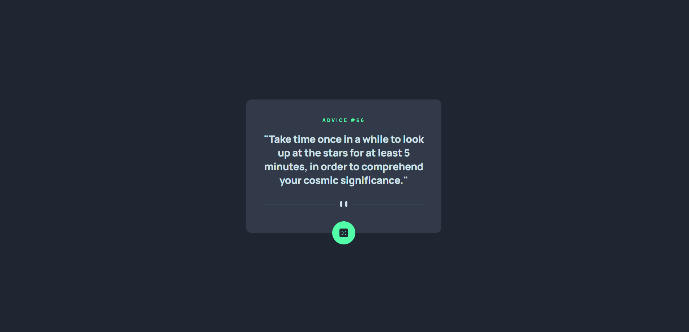
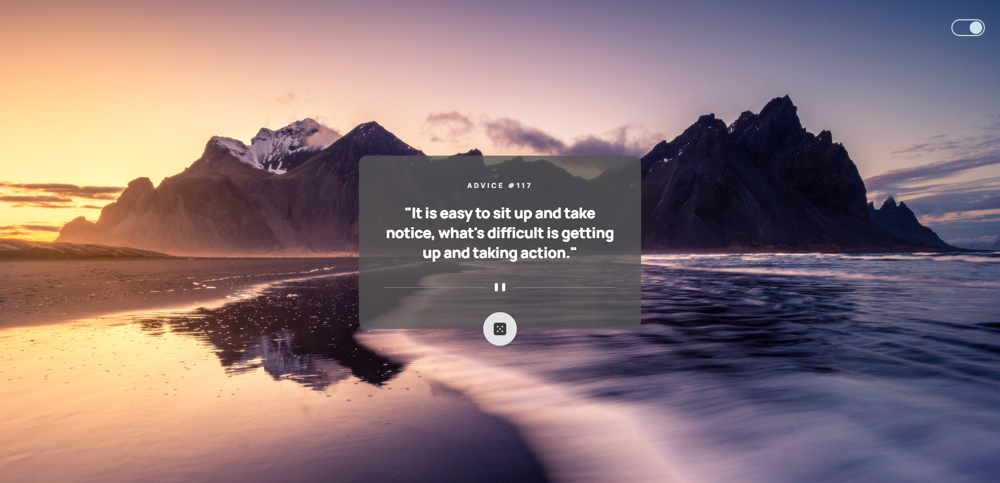

# Frontend Mentor - Advice generator app solution

This is a solution to the [Advice generator app challenge on Frontend Mentor](https://www.frontendmentor.io/challenges/advice-generator-app-QdUG-13db). Frontend Mentor challenges help you improve your coding skills by building realistic projects.

## Table of contents

- [Overview](#overview)
  - [The challenge](#the-challenge)
  - [Screenshot](#screenshot)
  - [Links](#links)
- [My process](#my-process)
  - [Built with](#built-with)
  - [What I learned](#what-i-learned)
- [Author](#author)
- [Acknowledgments](#acknowledgments)

## Overview

### The challenge

Users should be able to:

- View the optimal layout for the app depending on their device's screen size
- See hover states for all interactive elements on the page
- Generate a new piece of advice by clicking the dice icon
- Toggle between original background and a beautiful background image by photographer David Becker

### Screenshot

- Main - 
- Background-image mode - 

### Links

- Solution URL: [Add solution URL here](https://your-solution-url.com)
- Live Site URL: [Add live site URL here](https://your-live-site-url.com)

## My process

### Built with

- Semantic HTML5 markup
- CSS custom properties
- Flexbox
- CSS Grid
- Desktop-first workflow
- [jQuery](https://reactjs.org/) - JS library
- [Styled Components](https://styled-components.com/) - For styles

### What I learned

I learnt that it is necessary to use $(document).ready()to ensure that the DOM (Document Object Model) is fully loaded before executing any JavaScript code. If I try to access an element in the DOM before it has been fully loaded, the code may not work as expected.

## Author

- Frontend Mentor - [@Jo-cloud85](https://www.frontendmentor.io/profile/Jo-cloud85)

## Acknowledgments

Background photo by [David Becker on Unsplash](Photo by <a href="https://unsplash.com/@beckerworks?utm_source=unsplash&utm_medium=referral&utm_content=creditCopyText">David Becker</a> on <a href="https://unsplash.com/photos/x_mbiZ99ay8?utm_source=unsplash&utm_medium=referral&utm_content=creditCopyText">Unsplash</a>)
